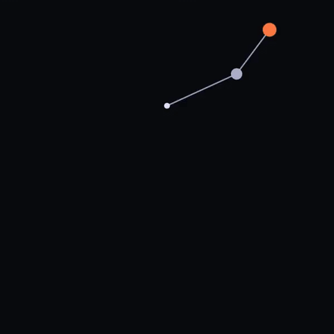

# Equanim v0.1

A declarative, JSON-based animation specification. Every visual property is a math expression evaluated at runtime. Four time/duration variables are always available in every expression: `t` (local 0→1), `d` (local seconds), `root_t` (global 0→1), and `root_d` (total seconds). Specs are designed to be AI-generatable, renderer-agnostic, and human-readable.



---

## Top-level structure

```json
{
  "spec": "equanim/0.1",
  "meta": { ... },
  "variables": { ... },
  "systems": [ ... ],
  "scene": { ... }
}
```

| Field       | Required | Description                                                    |
| ----------- | -------- | -------------------------------------------------------------- |
| `spec`      | yes      | Always `"equanim/0.1"`                                         |
| `meta`      | yes      | Canvas dimensions, fps, duration, coordinate system            |
| `variables` | no       | User-controllable runtime parameters                           |
| `systems`   | no       | Physics simulation systems (ODE). Processed before rendering.  |
| `scene`     | yes      | Visual objects to draw                                         |

---

## `meta` block

| Field               | Type   | Description                       |
| ------------------- | ------ | --------------------------------- |
| `title`             | string | Human-readable name               |
| `duration`          | number | Total animation length in seconds |
| `width`             | number | Output width in px                |
| `height`            | number | Output height in px               |
| `fps`               | number | Frames per second                 |
| `coordinate_system` | string | Always `"cartesian"` for now      |
| `origin`            | string | `"center"` or `"top-left"`        |

---

## `variables` block

Optional. Defines named values that are exposed to the user as runtime controls (sliders, inputs, etc.). Variable values are injected into every object's expression scope, overriding same-named entries in a `params` block.

```json
"variables": {
  "amplitude": { "label": "Amplitude",  "default": 80,  "min": 10, "max": 200, "step": 1 },
  "decay":     { "label": "Decay rate", "default": 1.8, "min": 0.1, "max": 6,  "step": 0.05 }
}
```

| Field     | Type   | Required | Description                                         |
| --------- | ------ | -------- | --------------------------------------------------- |
| `label`   | string | no       | Human-readable control label. Defaults to key name. |
| `default` | number | yes      | Initial value                                       |
| `min`     | number | yes      | Slider minimum                                      |
| `max`     | number | yes      | Slider maximum                                      |
| `step`    | number | no       | Slider step. Defaults to `(max - min) / 100`        |

Variables are intentionally format-agnostic — a consumer can render them as sliders, number inputs, dropdowns, or anything else.

---

## `systems` block

Optional. Defines physics simulation systems that are integrated numerically before playback begins. Systems are non-renderable — they produce trajectory data, not pixels.

Each system's state variables are exposed as callable interpolation functions in every scene object's expression scope, using the naming convention `<id>_<var>(t_seconds)`.

```json
"systems": [
  {
    "id": "phys",
    "type": "ode_system",
    "state": { "y": 180.0, "vy": 0.0 },
    "derivatives": { "y": "vy", "vy": "-g" },
    "events": [
      {
        "condition": "y - floor_y",
        "direction": "falling",
        "mutations": { "vy": "-e * vy" }
      }
    ],
    "solver": "rk4",
    "step": 0.001
  }
]
```

### `ode_system`

Integrates a system of first-order ODEs (RK4) over the full animation duration. State variables become interpolators available in all scene objects.

| Field         | Required | Description                                                              |
| ------------- | -------- | ------------------------------------------------------------------------ |
| `id`          | yes      | Identifier. State vars are exposed as `<id>_<var>(t_seconds)`.           |
| `type`        | yes      | Always `"ode_system"`                                                    |
| `state`       | yes      | Initial conditions: `{ varName: initialValue }`                          |
| `derivatives` | yes      | RHS expressions: `{ varName: "expression for d(var)/dt" }`              |
| `params`      | no       | Named constants in scope for derivative and event expressions            |
| `events`      | no       | Zero-crossing event triggers (see below)                                 |
| `solver`      | no       | Numerical method. Default: `"rk4"`                                       |
| `step`        | no       | Integration step in seconds. Smaller = more accurate. Default: `0.001`  |

**Derivative expressions** have access to: all current state variable values, the system's `params`, and all spec `variables`.

### Events

Zero-crossing events fire when a condition expression changes sign. At the crossing instant, state mutations are applied simultaneously (all evaluated from the pre-mutation state, so velocity swaps in elastic collisions are computed correctly).

```json
"events": [
  {
    "condition": "y - floor_y",
    "direction": "falling",
    "mutations": { "vy": "-e * vy" }
  }
]
```

| Field       | Description                                                               |
| ----------- | ------------------------------------------------------------------------- |
| `condition` | Expression monitored for zero-crossings. Uses same scope as derivatives.  |
| `direction` | `"rising"` (neg→pos), `"falling"` (pos→neg), or `"either"`               |
| `mutations` | State mutations applied at the crossing: `{ varName: "expression" }`     |

Multiple systems are allowed. Each runs independently; they cannot reference each other's state directly.

---

## `scene` block

```json
"scene": {
  "id": "root",
  "objects": [ ...array of visual primitives... ]
}
```

Scenes can be nested. Speed scaling via a `speed` multiplier (e.g. `0.8`, `1.5`) is planned.

---

## Primitive types

### Shared fields

All primitives share these fields:

| Field       | Type   | Description                                                                        |
| ----------- | ------ | ---------------------------------------------------------------------------------- |
| `id`        | string | Unique identifier within the scene                                                 |
| `type`      | string | Primitive type name                                                                |
| `style`     | object | Visual style (see below)                                                           |
| `params`    | object | Named number constants scoped to this object                                       |
| `functions` | object | Named sub-expressions (see below)                                                  |
| `timeline`  | object | `{ "start": number, "end": number }` — fractions of total duration, both in [0, 1] |

**Timeline** values are normalised fractions of `meta.duration`, not absolute seconds. This keeps specs portable across different durations and makes relative timing relationships obvious at a glance.

| Value | Meaning         |
| ----- | --------------- |
| `0`   | Animation start |
| `1`   | Animation end   |
| `0.5` | Halfway point   |

Examples for a 4-second animation:

- `{ "start": 0, "end": 1 }` → visible the whole time (0–4s)
- `{ "start": 0, "end": 0.5 }` → first half only (0–2s)
- `{ "start": 0.25, "end": 0.75 }` → middle half (1–3s)

**Style fields:**

| Field          | Type   | Description           |
| -------------- | ------ | --------------------- |
| `stroke`       | string | CSS color string      |
| `stroke_width` | number | Line width in px      |
| `fill`         | string | CSS color or `"none"` |

---

### `parametric_path`

A path where every point is computed from equations. The spatial parameter `s` sweeps across a domain and `x(s,t,...)` / `y(s,t,...)` define where each point lands at a given time.

```json
{
  "id": "wave",
  "type": "parametric_path",
  "style": {
    "stroke": "#44aaff",
    "stroke_width": 2.5,
    "fill": "none"
  },
  "domain": {
    "s": [-500, 500],
    "samples": 800
  },
  "equations": {
    "x": "s",
    "y": "A(t) * E(s, t) * sin(k * s - omega * t)"
  },
  "functions": {
    "A": { "args": ["t"], "body": "amplitude * exp(-decay * t)" },
    "E": { "args": ["s", "t"], "body": "clamp(omega * t - abs(k * s), 0, 1)" }
  },
  "timeline": { "start": 0.0, "end": 1.0 }
}
```

**Rendering logic:**

1. For each frame at global time `T`, iterate `s` from `domain.s[0]` to `domain.s[1]` in `samples` steps
2. Evaluate `x(s, t, ...)` and `y(s, t, ...)` for each step (all four time/duration variables are in scope)
3. Draw a polyline through all resulting points

---

### `line`

A static or animated straight line defined by two endpoints.

```json
{
  "id": "baseline",
  "type": "line",
  "style": {
    "stroke": "#ffffff22",
    "stroke_width": 1
  },
  "equations": {
    "x1": "-500",
    "y1": "0",
    "x2": "500",
    "y2": "0"
  },
  "timeline": { "start": 0.0, "end": 1.0 }
}
```

Any equation value can be a constant (`"0"`) or a time-varying expression (`"100 * sin(t * pi)"` for a portable single-cycle sweep, `"100 * sin(root_t * 2 * pi)"` to sync to the full animation).

---

### `circle`

A filled or stroked circle defined by its centre and radius as equations.

```json
{
  "id": "ball",
  "type": "circle",
  "style": {
    "fill": "#ff6644",
    "stroke": "#ff9977",
    "stroke_width": 2
  },
  "equations": {
    "cx": "0",
    "cy": "-190 + radius + B(t * d)",
    "r": "radius"
  },
  "functions": {
    "p": { "args": ["ts"], "body": "(ts / sqrt(2 * h0 / g)) % 1" },
    "H": { "args": ["ts"], "body": "h0 * exp(-decay * ts)" },
    "B": { "args": ["ts"], "body": "H(ts) * 4 * p(ts) * (1 - p(ts))" }
  },
  "timeline": { "start": 0.0, "end": 1.0 }
}
```

`cx` and `cy` are in spec space and go through the standard coordinate transform. `r` is a scalar magnitude in spec units — it is not y-flipped. Negative values are treated as their absolute value.

---

### Planned primitives

- `rect` — `x`, `y`, `width`, `height` as equations
- `text` — position, content, font, size
- `group` — container for transforming multiple objects together

---

## Expression syntax

Equations are math expression strings evaluated at runtime using [mathjs](https://mathjs.org/).

### Variables in scope

Four time/duration variables are always available. They come in two pairs — local (relative to the object's own window) and global (relative to the full animation):

| Name     | Value range | Description                                               |
| -------- | ----------- | --------------------------------------------------------- |
| `t`      | 0 → 1       | Local normalised time over the object's own timeline window. `t=0` when the object enters; `t=1` when it exits. Default choice for portable animations. |
| `d`      | seconds     | Local duration — length of the object's own window in seconds. Multiply to convert: `t * d` = local seconds elapsed since the object started. |
| `root_t` | 0 → 1       | Global normalised time over the full animation (`T / meta.duration`). Use to sync effects across objects regardless of their individual windows. |
| `root_d` | seconds     | Total animation duration in seconds (`meta.duration`). Multiply to convert: `root_t * root_d` = global seconds elapsed. |

**When to use each:**

- `t` — default. Fade, ease, sweep — anything that should complete within the object's own window.
- `d` — when you need real seconds locally (e.g. a decay rate in units of per-second: `exp(-k * t * d)`).
- `root_t` — when multiple objects need to stay in sync with the whole animation regardless of their individual windows.
- `root_d` — when combining with `root_t` to express global durations, or for expressions that scale with total animation length.

**Future group scoping:** When groups are introduced, each group will expose its own `<group_id>_t` and `<group_id>_d` to its children, following the same pattern. Object and group IDs must therefore be valid identifiers: letters, digits, and underscores only; no hyphens; cannot start with a digit.

| Name       | Available in      | Description                                              |
| ---------- | ----------------- | -------------------------------------------------------- |
| `t`        | all equations     | Local normalised time 0→1 over this object's window      |
| `d`        | all equations     | Local duration in seconds                                |
| `root_t`   | all equations     | Global normalised time 0→1 over the full animation       |
| `root_d`   | all equations     | Total animation duration in seconds                      |
| `s`        | `parametric_path` | Spatial parameter swept across `domain.s`                |
| _(params)_ | all equations     | Keys from the object's `params` block                    |
| _(vars)_   | all equations     | Keys from the spec's `variables` block (override params) |

### Math builtins

| Function             | Description                 |
| -------------------- | --------------------------- |
| `sin(x)`             | Sine                        |
| `cos(x)`             | Cosine                      |
| `exp(x)`             | e^x                         |
| `abs(x)`             | Absolute value              |
| `clamp(x, min, max)` | Clamp x between min and max |
| `sqrt(x)`            | Square root                 |
| `pow(x, n)`          | x to the power n            |
| `pi`                 | 3.14159...                  |

### `params` block

Named number constants scoped to the object. Good for fixed values that don't need to be user-controllable.

```json
"params": { "k": 0.018, "omega": 6.28 }
```

### `functions` block

Named sub-expressions that accept arguments. Evaluated inline when the parent equation references them.

```json
"functions": {
  "A": { "args": ["t"],      "body": "amplitude * exp(-decay * t)" },
  "E": { "args": ["s", "t"], "body": "clamp(omega * t - abs(k * s), 0, 1)" }
}
```

Each function definition has:

- `args` — ordered list of argument names (referenced positionally in call sites)
- `body` — expression string; has access to all scope variables plus the named args

> **Note on format:** Earlier drafts encoded the signature in the key (`"A(t)": "expr"`). This was dropped because it required regex-parsing keys and was ambiguous. The current `{ args, body }` format is explicit and unambiguous.

---

## Coordinate system

Spec space is Cartesian (y-up). Canvas space is y-down. Renderers must transform:

```
canvas_x = width/2  + spec_x      (for origin="center")
canvas_y = height/2 - spec_y      (y-flip)
```

For `origin="top-left"`, no transform is applied.

---

## Hello world: Double Pendulum

The canonical example. Real Lagrangian physics in a JSON file — no code, just ODEs and expressions. Live file: [`renderer/specs/double-pendulum.json`](renderer/specs/double-pendulum.json).

The physics system lives in `systems` — separate from the visual objects in `scene`. The `ode_system` integrates the equations of motion (RK4, step=0.005s) before playback. Each state variable is exposed as a callable interpolator — `phys_th1(t*d)`, `phys_th2(t*d)` — available in every scene object's expression scope.

```json
{
  "spec": "equanim/0.1",
  "meta": {
    "title": "Double Pendulum",
    "duration": 30.0,
    "width": 600,
    "height": 600,
    "fps": 60,
    "coordinate_system": "cartesian",
    "origin": "center"
  },
  "variables": {
    "L1":  { "label": "Arm 1 length (m)", "default": 2.5, "min": 0.5, "max": 5.0,  "step": 0.1 },
    "L2":  { "label": "Arm 2 length (m)", "default": 1.8, "min": 0.3, "max": 4.0,  "step": 0.1 },
    "m1":  { "label": "Bob 1 mass (kg)",  "default": 2.0, "min": 0.5, "max": 5.0,  "step": 0.1 },
    "m2":  { "label": "Bob 2 mass (kg)",  "default": 1.0, "min": 0.5, "max": 5.0,  "step": 0.1 },
    "g":   { "label": "Gravity (m/s²)",   "default": 9.8, "min": 1.0, "max": 30.0, "step": 0.1 },
    "ppm": { "label": "Pixels per metre", "default": 55,  "min": 20,  "max": 120,  "step": 5   }
  },
  "systems": [
    {
      "id": "phys",
      "type": "ode_system",
      "state": { "th1": 2.0, "w1": 0.0, "th2": 2.5, "w2": 0.0 },
      "derivatives": {
        "th1": "w1",
        "w1":  "(-g*(2*m1+m2)*sin(th1) - m2*g*sin(th1-2*th2) - 2*sin(th1-th2)*m2*(w2^2*L2 + w1^2*L1*cos(th1-th2))) / (L1*(2*m1+m2 - m2*cos(2*(th1-th2))))",
        "th2": "w2",
        "w2":  "(2*sin(th1-th2)*(w1^2*L1*(m1+m2) + g*(m1+m2)*cos(th1) + w2^2*L2*m2*cos(th1-th2))) / (L2*(2*m1+m2 - m2*cos(2*(th1-th2))))"
      },
      "solver": "rk4",
      "step": 0.005
    }
  ],
  "scene": {
    "id": "root",
    "objects": [
      {
        "id": "trace",
        "type": "parametric_path",
        "style": { "stroke": "#44aaff55", "stroke_width": 1.5, "fill": "none" },
        "domain": { "s": [0, 1], "samples": 1500 },
        "params": { "y_off": 110 },
        "equations": {
          "x": "L1*ppm*sin(phys_th1(clamp(s,0,root_t)*root_d)) + L2*ppm*sin(phys_th2(clamp(s,0,root_t)*root_d))",
          "y": "y_off - L1*ppm*cos(phys_th1(clamp(s,0,root_t)*root_d)) - L2*ppm*cos(phys_th2(clamp(s,0,root_t)*root_d))"
        },
        "timeline": { "start": 0.0, "end": 1.0 }
      },
      {
        "id": "arm1",
        "type": "line",
        "style": { "stroke": "#9999bb", "stroke_width": 2.5 },
        "params": { "y_off": 110 },
        "equations": {
          "x1": "0", "y1": "y_off",
          "x2": "L1*ppm*sin(phys_th1(t*d))",
          "y2": "y_off - L1*ppm*cos(phys_th1(t*d))"
        },
        "timeline": { "start": 0.0, "end": 1.0 }
      },
      {
        "id": "arm2",
        "type": "line",
        "style": { "stroke": "#9999bb", "stroke_width": 2.5 },
        "params": { "y_off": 110 },
        "equations": {
          "x1": "L1*ppm*sin(phys_th1(t*d))",
          "y1": "y_off - L1*ppm*cos(phys_th1(t*d))",
          "x2": "L1*ppm*sin(phys_th1(t*d)) + L2*ppm*sin(phys_th2(t*d))",
          "y2": "y_off - L1*ppm*cos(phys_th1(t*d)) - L2*ppm*cos(phys_th2(t*d))"
        },
        "timeline": { "start": 0.0, "end": 1.0 }
      },
      {
        "id": "bob2",
        "type": "circle",
        "style": { "fill": "#ff7744", "stroke": "#ff994455", "stroke_width": 2 },
        "params": { "y_off": 110 },
        "equations": {
          "cx": "L1*ppm*sin(phys_th1(t*d)) + L2*ppm*sin(phys_th2(t*d))",
          "cy": "y_off - L1*ppm*cos(phys_th1(t*d)) - L2*ppm*cos(phys_th2(t*d))",
          "r":  "12"
        },
        "timeline": { "start": 0.0, "end": 1.0 }
      }
    ]
  }
}
```

---

## Open questions

- [ ] Scene nesting: does a child scene's `t` run over its own duration, or the parent's?
- [ ] Should `samples` be adaptive (more samples where curvature is high)?
- [ ] Export format: `captureStream()` + `MediaRecorder` for WebM is the path of least resistance
- [ ] Spec validation: should the renderer return structured errors on malformed specs?
- [ ] `functions` referencing other `functions` (recursive / mutually recursive) — currently undefined behaviour
